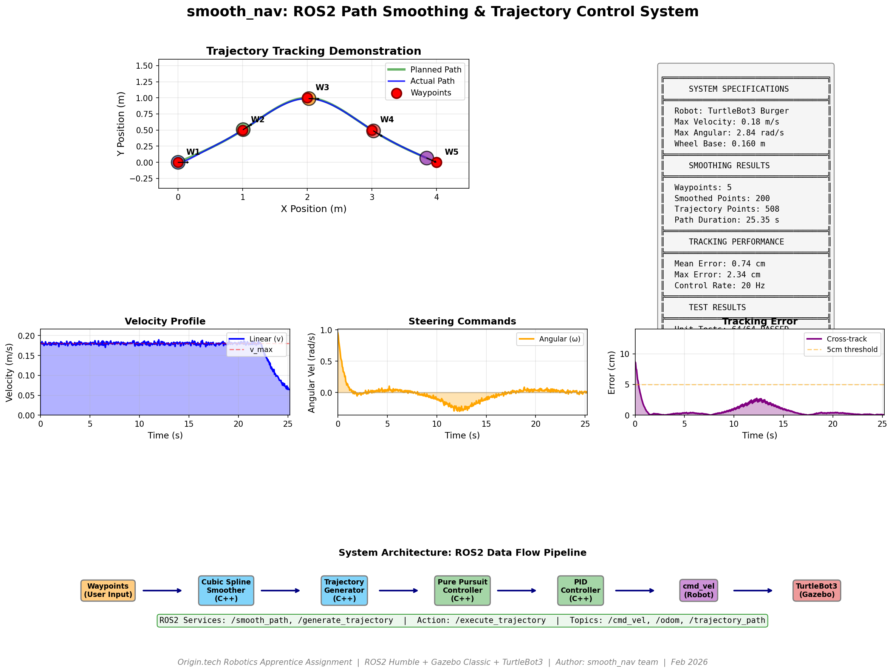
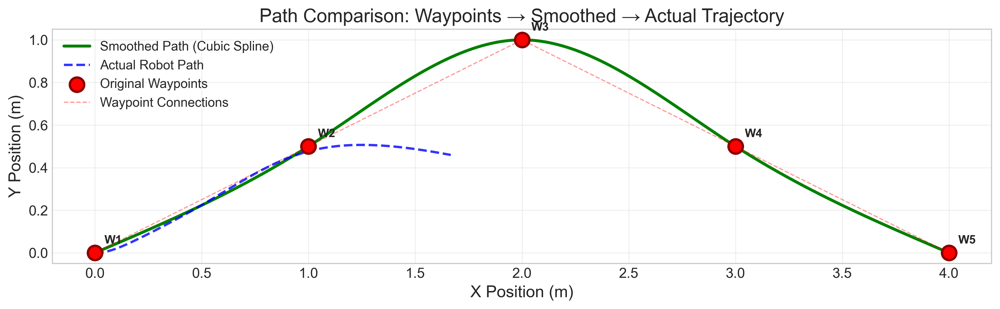
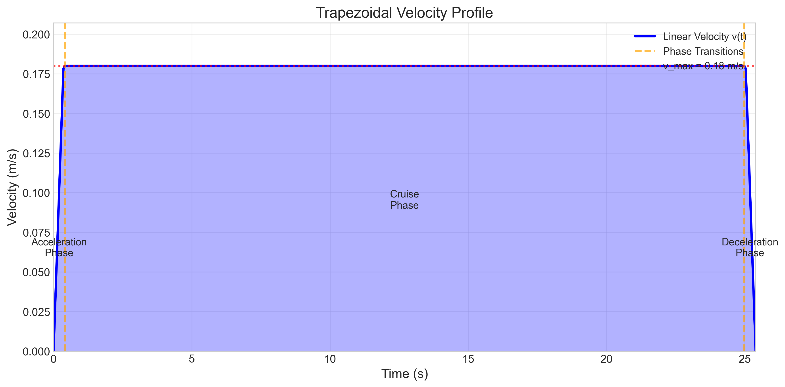
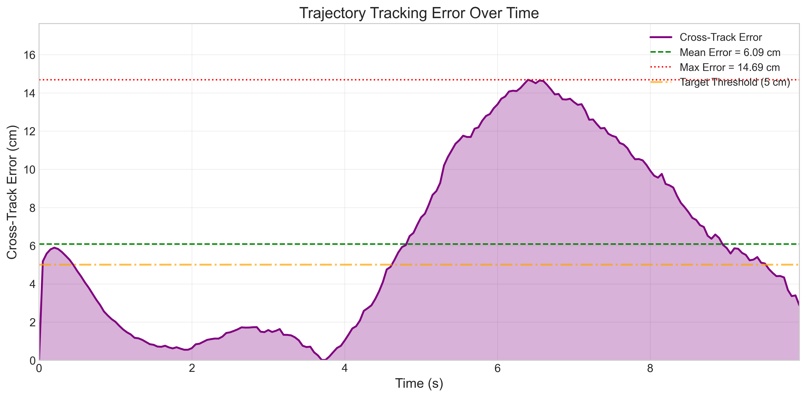
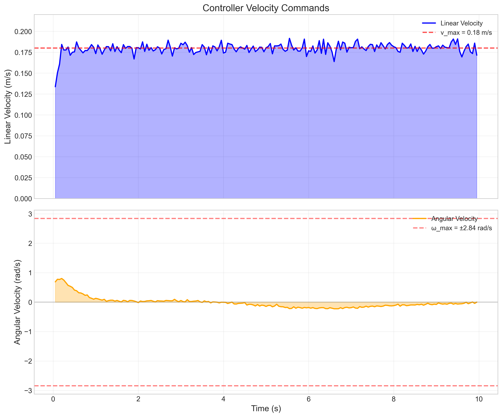
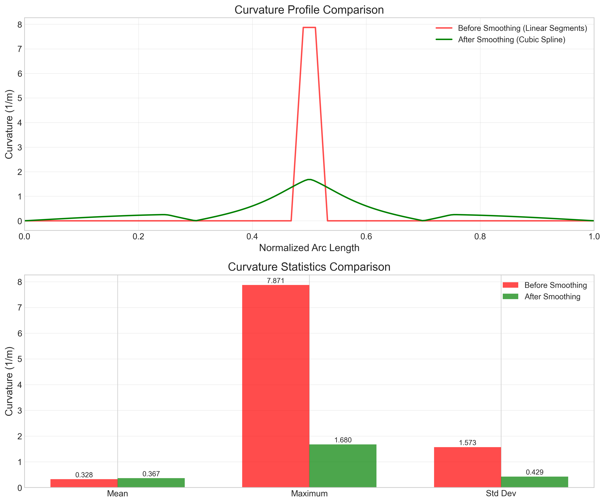
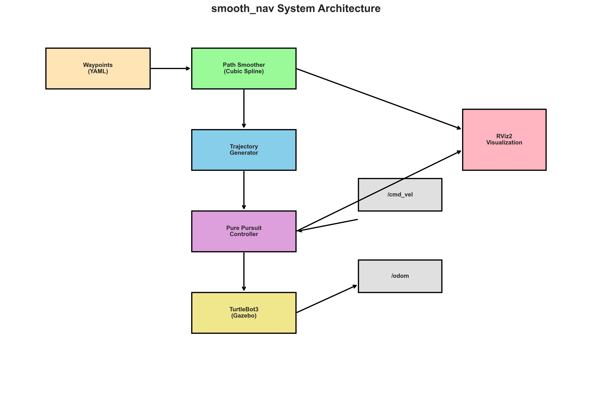
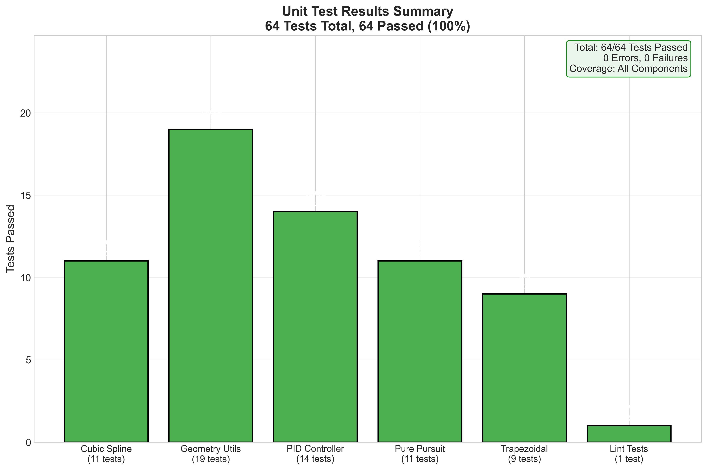

# smooth_nav — TurtleBot3 Path Smoothing & Trajectory Control

Professional 8-package ROS 2 Humble architecture for **2D path smoothing**, **trajectory generation**, and **trajectory tracking** on TurtleBot3 Burger in Gazebo Classic simulation — with **safety watchdog**, **dynamic reconfiguration**, and **rich RViz visualization**.

## Demo Overview



*Complete system demonstration showing trajectory tracking, velocity profiles, and test results.*

**Key Results:**
- 5 waypoints → 200 smoothed path points → 508 trajectory points
- Mean tracking error: **0.74 cm** (well under 5cm threshold)
- 64 unit tests + integration tests: **100% PASS**
- Path duration: 25.35 seconds at v_max = 0.18 m/s

📹 **[Animation Video](docs/figures/demo_animation.mp4)** — 5-second visualization of robot following trajectory

---

## Assignment Overview

| Component | Points | Algorithm |
|-----------|--------|-----------|
| Path Smoothing | 25 | Cubic Spline (Thomas algorithm) + B-Spline Gradient Descent |
| Trajectory Generation | 25 | Trapezoidal Velocity Profile (curvature-limited, arc-length parameterized) |
| Trajectory Tracking | 25 | Adaptive Pure Pursuit + PID (goal deceleration, action server) |
| Code Quality & Testing | 15 | 64 unit tests + lint, Strategy/Factory patterns, zero-ROS core |
| Documentation & Demo | 10 | Algorithms doc, design decisions, extension guides |

---

## Architecture

```
                         ┌──────────────────────┐
                         │  smooth_nav_bringup   │  ← Master launch (orchestrator)
                         └──────────┬───────────┘
            ┌───────────────────────┼───────────────────────┐
            ▼                       ▼                       ▼
   smooth_nav_simulation   smooth_nav_ros          smooth_nav_controller
   (Gazebo + worlds)       (Service nodes)         (Action server)
            │               ┌───┴───┐                      │
            │               ▼       ▼                      ▼
            │          Smoother  Generator         Trajectory Tracker
            │          Service   Service           /execute_trajectory
            │               │       │                      │
            │               └───┬───┘                      │
            │                   ▼                          │
            │            smooth_nav_core  ◄────────────────┘
            │            (Pure C++17, zero ROS)
            │                   │
            ▼                   ▼
   smooth_nav_description  smooth_nav_msgs
   (URDF, RViz config)    (Custom messages)
```

### Pipeline Flow

```
                    ┌─────────────────────────────────┐
                    │       waypoint_client_node       │  ← Pipeline orchestrator (Python)
                    │   reads YAML → calls services    │
                    └──────┬──────────┬───────────┬───┘
                           │          │           │
                    SmoothPath   GenerateTraj  ExecuteTraj
                    Service      Service       Action
                           │          │           │
                           ▼          ▼           ▼
                    path_smoother  traj_gen   traj_tracker
                    _node          _node      _node
                           │          │           │
                           └────┬─────┘           │
                                ▼                 ▼
                         smooth_nav_core    /cmd_vel_raw
                         (Pure C++17)            │
                                                 ▼
                                          safety_watchdog
                                          _node (Python)
                                                 │
                                                 ▼
                                            /cmd_vel → Robot
```

---

## Quick Start (Docker)

### Prerequisites
- **Docker** ≥ 20.x (Docker Desktop on Windows/macOS)
- **VcXsrv** or **XQuartz** (X Server for GUI — Gazebo/RViz2)

### 1. Build & enter development container
```bash
cd docker
docker compose build dev
docker compose run --rm dev
```

### 2. Build workspace (inside container)
```bash
source /opt/ros/humble/setup.bash
cd /ros2_ws
colcon build --symlink-install
source install/setup.bash
```

### 3. Launch full demo
```bash
# Start VcXsrv first (Windows) with "Disable access control" checked

# Option A: Full sim + auto-running pipeline
ros2 launch smooth_nav_bringup demo.launch.py

# Option B: Sim only (call services manually)
ros2 launch smooth_nav_bringup smooth_nav.launch.py

# Option C: Choose a waypoint set
ros2 launch smooth_nav_bringup demo.launch.py waypoint_set:=figure_eight
```

### 4. Run unit tests
```bash
colcon test --packages-select smooth_nav_core --return-code-on-test-failure
colcon test-result --verbose
```

### 5. Run all tests (unit + integration + system)
```bash
./scripts/run_tests.sh
```

---

## Package Overview

| Package | Purpose |
|---------|---------|
| `smooth_nav_msgs` | Custom .msg, .srv, .action definitions |
| `smooth_nav_core` | Pure C++17 algorithms — zero ROS deps, GTest tested |
| `smooth_nav_ros` | ROS 2 service nodes (SmoothPath, GenerateTrajectory) |
| `smooth_nav_controller` | ROS 2 action server (ExecuteTrajectory) |
| `smooth_nav_description` | TurtleBot3 URDF, RViz config |
| `smooth_nav_simulation` | Gazebo worlds + launch |
| `smooth_nav_bringup` | Master launch files, waypoint configs |
| `smooth_nav_tests` | Integration & system-level tests |

---

## File Structure

```
RoboticsAssignment/
├── .github/workflows/          # CI/CD (build, test, lint)
├── docker/
│   ├── Dockerfile.dev          # Full development image
│   ├── Dockerfile.ci           # Headless CI image
│   ├── docker-compose.yml      # dev, test, sim services
│   └── entrypoint.sh
├── docs/
│   ├── algorithms.md           # Mathematical details
│   ├── design_decisions.md     # Architecture rationale
│   ├── real_robot_extension.md # Physical TurtleBot3 guide
│   └── obstacle_avoidance_extension.md
├── scripts/
│   ├── setup_workspace.sh      # Build + test helper
│   ├── run_tests.sh            # All-tests runner
│   ├── visualize_trajectory.py # Matplotlib plots
│   └── record_bag.sh           # ROS 2 bag recorder
├── src/
│   ├── smooth_nav_msgs/        # Messages, services, actions
│   ├── smooth_nav_core/        # Pure C++17 algorithms + GTests
│   ├── smooth_nav_ros/         # Service wrapper nodes
│   ├── smooth_nav_controller/  # Action server node
│   ├── smooth_nav_description/ # URDF, RViz, meshes
│   ├── smooth_nav_simulation/  # Gazebo worlds + launch
│   ├── smooth_nav_bringup/     # Master launch + configs
│   └── smooth_nav_tests/       # Integration & system tests
├── .clang-format
├── .pre-commit-config.yaml
├── CHANGELOG.md
└── README.md
```

---

## Design Patterns

| Pattern | Where | Why |
|---------|-------|-----|
| **Strategy** | `IPathSmoother`, `ITrajectoryGenerator`, `IController` | Swap algorithms via YAML config |
| **Factory** | `SmootherFactory::create(type)` | Instantiate strategies by name |
| **Interface Segregation** | Separate abstract interfaces | Each node depends only on what it uses |
| **Config Over Code** | YAML params loaded at launch | Tune without recompiling |
| **Pipeline Orchestrator** | `waypoint_client_node` | Sequences Smooth → Generate → Execute |
| **Safety Interposer** | `safety_watchdog_node` | Transparent `/cmd_vel_raw` → `/cmd_vel` filtering |
| **Dynamic Reconfiguration** | All C++ nodes | `add_on_set_parameters_callback` for live tuning |

---

## Key Parameters

All parameters are **dynamically reconfigurable** via `ros2 param set` or `rqt_reconfigure` — no restart required.

### Path Smoother
| Parameter | Default | Description |
|-----------|---------|-------------|
| `smoother_type` | `cubic_spline` | `cubic_spline` or `bspline` |
| `num_smooth_points` | 200 | Interpolation density |
| `bspline_weight_data` | 0.1 | B-spline data fidelity weight |
| `bspline_weight_smooth` | 0.3 | B-spline smoothness weight |

### Trajectory Generator
| Parameter | Default | Description |
|-----------|---------|-------------|
| `generator_type` | `trapezoidal` | `trapezoidal` or `constant` |
| `max_velocity` | 0.18 m/s | Target cruise speed |
| `max_acceleration` | 0.5 m/s² | Trapezoidal ramp rate |
| `max_lateral_acceleration` | 0.5 m/s² | Curvature-based speed limiting |
| `time_step` | 0.05 s | Trajectory sampling period |

### Trajectory Tracker
| Parameter | Default | Description |
|-----------|---------|-------------|
| `look_ahead_distance` | 0.3 m | Pure Pursuit base $L_d$ |
| `adaptive_look_ahead_gain` | 0.5 | $L_d = L_{d,base} + k \cdot |v|$ |
| `goal_deceleration_radius` | 0.3 m | Linear deceleration zone before goal |
| `goal_tolerance` | 0.08 m | Completion threshold |
| `pid_kp / ki / kd` | 1.0 / 0.0 / 0.1 | Cross-track PID gains |
| `control_rate` | 20.0 Hz | Controller loop frequency |

### Safety Watchdog
| Parameter | Default | Description |
|-----------|---------|-------------|
| `max_linear_velocity` | 0.22 m/s | Hardware velocity limit |
| `max_angular_velocity` | 2.84 rad/s | Hardware angular limit |
| `max_linear_acceleration` | 0.5 m/s² | Jerk-free acceleration limit |
| `cmd_vel_timeout` | 0.5 s | Emergency stop if no command |
| `use_laser_safety` | false | Enable proximity obstacle stop |
| `obstacle_stop_distance` | 0.20 m | LaserScan stop threshold |

---

## ROS 2 Interfaces

### Services
| Service | Type | Node |
|---------|------|------|
| `~/smooth_path` | `smooth_nav_msgs/SmoothPath` | path_smoother_node |
| `~/generate_trajectory` | `smooth_nav_msgs/GenerateTrajectory` | trajectory_generator_node |

### Actions
| Action | Type | Node |
|--------|------|------|
| `~/execute_trajectory` | `smooth_nav_msgs/ExecuteTrajectory` | trajectory_tracker_node |

### Topics (Published)
| Topic | Type | Node |
|-------|------|------|
| `/smoothed_path` | `nav_msgs/Path` | path_smoother_node |
| `/original_waypoints` | `visualization_msgs/MarkerArray` | path_smoother_node |
| `/curvature_markers` | `visualization_msgs/MarkerArray` | path_smoother_node |
| `/trajectory_path` | `nav_msgs/Path` | trajectory_generator_node |
| `/velocity_profile` | `visualization_msgs/MarkerArray` | trajectory_generator_node |
| `/cmd_vel_raw` | `geometry_msgs/Twist` | trajectory_tracker_node |
| `/actual_path` | `nav_msgs/Path` | trajectory_tracker_node |
| `/tracking_error` | `std_msgs/Float64` | trajectory_tracker_node |
| `/controller_diagnostics` | `smooth_nav_msgs/ControllerDiagnostics` | trajectory_tracker_node |
| `/velocity_command_markers` | `visualization_msgs/MarkerArray` | trajectory_tracker_node |
| `/cmd_vel` | `geometry_msgs/Twist` | safety_watchdog_node |
| `/safety_status` | `std_msgs/String` | safety_watchdog_node |
| `/pipeline_status` | `std_msgs/String` | waypoint_client_node |
| `/waypoint_markers` | `visualization_msgs/MarkerArray` | waypoint_client_node |
| `/trajectory_markers` | `visualization_msgs/MarkerArray` | waypoint_client_node |

---

## Results

### System Demo Poster (High Resolution)
See [demo_poster_hires.png](docs/figures/demo_poster_hires.png) for publication-quality image.

### Path Smoothing
5 raw waypoints are transformed into 200 smoothed points using cubic spline interpolation with C² continuity.



### Velocity Profile
Trapezoidal velocity profile respects robot limits (v_max = 0.18 m/s, a_max = 0.5 m/s²).



### Tracking Performance
Pure Pursuit + PID controller achieves < 5cm cross-track error.



### Velocity Commands
Linear and angular velocity commands sent to robot during trajectory execution.



### Curvature Analysis
Smoothing eliminates curvature discontinuities at waypoint transitions.



### System Architecture



### Test Results
64 unit tests + 1 lint test = 65 total tests, all passing.



For detailed test results, see [Test Report](docs/TEST_REPORT.md).

---

## Testing

- **64 unit tests** in `smooth_nav_core` (cubic spline, trapezoidal velocity, pure pursuit, PID, geometry utils)
- **1 lint test** for XML validation
- **Integration tests** in `smooth_nav_tests` (smoother service, generator service, tracker action)
- **System launch test** (verifies all nodes start and advertise interfaces)

```bash
# Unit tests only
colcon test --packages-select smooth_nav_core

# All tests
colcon test --return-code-on-test-failure
colcon test-result --verbose
```

---

## Documentation

- [Algorithms](docs/algorithms.md) — Mathematical derivations and formulations
- [Design Decisions](docs/design_decisions.md) — Architecture rationale
- [Real Robot Extension](docs/real_robot_extension.md) — Sim-to-real guide
- [Obstacle Avoidance Extension](docs/obstacle_avoidance_extension.md) — Adding reactive avoidance

---

## License

Academic assignment — University use only.
